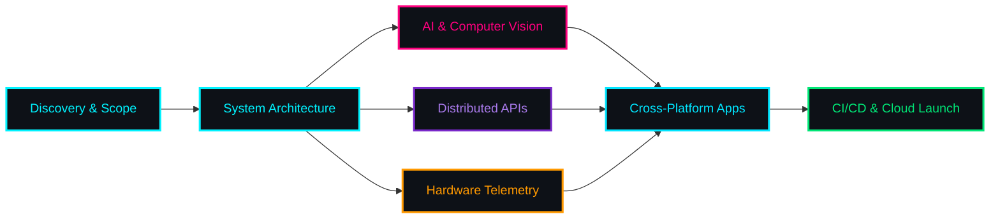

<div align="center">

  <!-- Top Cyber Dynamic Wave Banner -->
  

  <!-- Animated Dynamic Typing -->
  <a href="https://git.io/typing-svg">
    
  </a>

  <br/>

  <!-- Status & Quick CTAs -->
  <p align="center">
    <a href="mailto:pushpendrasachan.dev@gmail.com"></a>
    <a href="mailto:pushpendrasachan.dev@gmail.com"></a>
    <a href="https://linkedin.com/in/YOUR_LINKEDIN_USERNAME"></a>
    <a href="https://github.com/Pushpendera5"></a>
  </p>

  <!-- Live Profile Views Counter -->
  

</div>

---

### Architecture & Development Pipeline

<div align="center">



</div>

---

### Interactive Terminal Simulation

<div align="center">

```
┌──(pushpendra㉿workstation)-[~/production-hub]
└─$ ./run_pipeline.sh --mode=client-delivery

[+] Target: High-Performance Enterprise Architecture
[✓] AI Pipeline Loaded ...... Computer Vision & Intelligent OCR (FastAPI + PyTorch)
[✓] Core Backends ........... ASP.NET Core 10 / Node.js Microservices [ACTIVE]
[✓] Edge Hardware Link ...... UHF RFID Handheld Scanner Telemetry [SYNCHRONIZED]
[✓] Frontend Interface ...... React 19 + Flutter Multi-Platform UI [ONLINE]
[✓] Production Status ....... High-Throughput & Zero-Downtime Ready!

[★] Status: Available for Freelance Contracts & Architectural Consulting.
```

</div>

---

### Freelance Services & Capabilities Matrix

<div align="center">

| AI / ML & Automation | Full-Stack Web Systems | Cross-Platform Mobile | IoT & RFID Hardware |
| :---: | :---: | :---: | :---: |
| <br/>• Computer Vision & OCR<br/>• Intelligent Document Parsing<br/>• Custom Automation Pipelines | <br/>• High-Throughput APIs<br/>• Modern Web Apps (React/Vite)<br/>• Microservices Architecture | <br/>• Flutter Multi-Platform<br/>• Native Android Modules<br/>• Offline Data Syncing | <br/>• UHF RFID Tag Readers<br/>• Handheld Device SDKs<br/>• Warehouse & Retail Telemetry |

</div>

<br/>

<div align="center">

| Domain Focus | Specialty | Implementation |
| :--- | :--- | :--- |
| **Artificial Intelligence** | Intelligent OCR, Vision Models, LLM Automation | FastAPI, PyTorch, OpenCV, Transformers |
| **Full Stack & Cloud** | Microservices, High-Speed APIs, Real-time Feeds | ASP.NET Core 10, React, Node.js, Vite |
| **Edge Hardware / IoT** | UHF RFID Stream Processing, Terminal Integration | C#, Handheld SDKs, Android Native (Kotlin) |
| **Mobile Applications** | Cross-Platform Enterprise Field Applications | Flutter, Dart, SQLite Offline Sync |

</div>

---

### Technology Ecosystem

<div align="center">

#### Artificial Intelligence, Machine Learning & Vision
<p align="center">
  
</p>
<p align="center">
  
  
  
</p>

#### Full-Stack Web & Backend
<p align="center">
  
</p>

#### Mobile, IoT & Embedded Systems
<p align="center">
  
</p>
<p align="center">
  
  
  
</p>

#### Databases, Cloud & Tooling
<p align="center">
  
</p>

</div>

---

### Featured Production Projects

<table>
  <tr>
    <td width="50%">
      <div align="center">
        <h3>CardAI-CRM (AI Engine)</h3>
        
      </div>
      <br/>
      • <b>Category:</b> AI Document Intelligence & Automation<br/>
      • <b>Core Feat:</b> OCR business card image processing, automated entity extraction, smart CRM ingestion.<br/>
      • <b>Repository:</b> <a href="https://github.com/Pushpendera5/CardAI-CRM"><b>Pushpendera5/CardAI-CRM ↗</b></a>
    </td>
    <td width="50%">
      <div align="center">
        <h3>Bucket RFID Store (Enterprise)</h3>
        
      </div>
      <br/>
      • <b>Category:</b> Retail Automation & Live Telemetry<br/>
      • <b>Core Feat:</b> Full POS, Goods Received Notes (GRN), purchase orders, and real-time UHF RFID stream.<br/>
      • <b>Repository:</b> <a href="https://github.com/Pushpendera5/bucket-rfid-store"><b>Pushpendera5/bucket-rfid-store ↗</b></a>
    </td>
  </tr>
  <tr>
    <td width="50%">
      <div align="center">
        <h3>TrackMint RFID Tracker</h3>
        
      </div>
      <br/>
      • <b>Category:</b> Enterprise Mobile App<br/>
      • <b>Core Feat:</b> Built for industrial handheld scanners (Seuic AutoID UTouch 2) with offline audit caches.<br/>
      • <b>Repository:</b> <a href="https://github.com/Pushpendera5/trackmint-rfid-asset-tracker"><b>Pushpendera5/trackmint-rfid-asset-tracker ↗</b></a>
    </td>
    <td width="50%">
      <div align="center">
        <h3>Trace & Track Systems</h3>
        
      </div>
      <br/>
      • <b>Category:</b> Industrial Telemetry Engine<br/>
      • <b>Core Feat:</b> High-speed batch RFID scanning & ATA-standard read/write validation pipeline.<br/>
      • <b>Repository:</b> <a href="https://github.com/Pushpendera5/TRACE-AND-TRACK"><b>Pushpendera5/TRACE-AND-TRACK ↗</b></a>
    </td>
  </tr>
</table>

---

### Real-Time Performance & Activity Graph

<div align="center">
  <!-- Dynamic Activity Graphs -->
  
</div>

<br/>

<div align="center">
  <!-- Stats Cards in Dual Columns -->
  
  
</div>

<br/>

<div align="center">
  <!-- Streak Stats -->
  
</div>

---

### Let's Collaborate on Your Next Big Idea!

<div align="center">

  <p><b>Looking for a reliable freelance partner for AI/ML, Full Stack, or IoT? Let's connect!</b></p>

  <a href="mailto:pushpendrasachan.dev@gmail.com">
    
  </a>
  &nbsp;&nbsp;
  <a href="https://linkedin.com/in/YOUR_LINKEDIN_USERNAME">
    
  </a>

  <br/><br/>

  <!-- Animated Footer -->
  

  <sub>Crafted with precision & passion by <b>Pushpendra Sachan</b></sub>

</div>
